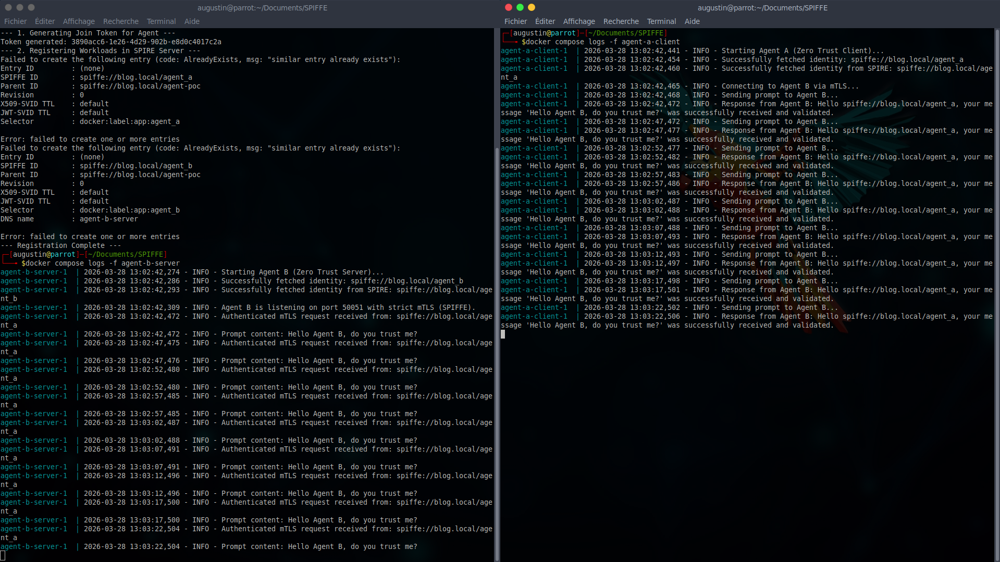

# Zero Trust mTLS for AI Agents with SPIFFE/SPIRE

This repository is a Proof of Concept (PoC) demonstrating how to establish secure, dynamically authenticated Machine-to-Machine (M2M) communication between two Python applications (AI Agents) using the **SPIFFE/SPIRE** framework and **gRPC**.

Instead of relying on easily compromised API keys or long-lived passwords, this architecture uses short-lived X.509 certificates tied directly to the cryptographic identity of the Docker containers (Workload Attestation).

## Architecture

1. **SPIRE Server**: Acts as the Certificate Authority (CA) and maintains the registry of authorized workloads.
2. **SPIRE Agent**: Runs alongside the workloads, validates their identity against the Linux kernel/Docker daemon (`pid`, `cgroups`), and securely provisions them with their SVIDs (SPIFFE Verifiable Identity Documents) via a Unix Domain Socket.
3. **Agent B (Server)**: A Python gRPC server requiring strict mTLS. It identifies itself as `spiffe://blog.local/agent_b`.
4. **Agent A (Client)**: A Python gRPC client. It identifies itself as `spiffe://blog.local/agent_a`, fetches the Trust Bundle, and connects to Agent B.

## Quick Start

### Prerequisites
* Docker & Docker Compose
* Bash environment

### 1. Start the Infrastructure
Launch the SPIRE control plane and the Python workloads:
```bash
docker compose up -d spire-server
docker compose exec spire-server /opt/spire/bin/spire-server token generate -spiffeID spiffe://blog.local/agent-poc
```
Important: Copy the generated token and paste it into the join_token field inside agent.conf.

### 2. Start the rest of the infrastructure
```bash
docker compose up -d
```

### 3. Register the Workloads
Run the initialization script to register Agent A and Agent B with the SPIRE Server. This allows the SPIRE Agent to issue them their respective certificates.
```bash
./init-spire.sh
```

### 4. Execution
Check the logs of the server (Agent B) to see it successfully fetching its identity and listening for requests:
```bash
docker compose logs -f agent-b-server
```
In a new terminal, check the logs of the client (Agent A) to see the mTLS handshake and the validated communication:
```bash
docker compose logs -f agent-a-client
```

You should see Agent B successfully decoding the SPIFFE ID of Agent A:
`Response from Agent B: Hello spiffe://blog.local/agent_a, your message 'Hello Agent B, do you trust me?' was successfully received and validated.`



## Security Notes
* No hardcoded credentials are used in the Python code.
* Certificates are fetched entirely in memory via the Workload API.